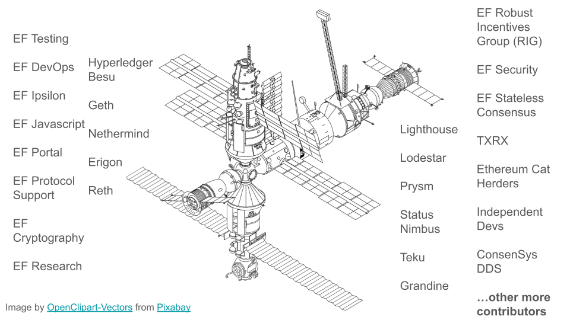

# Core development 

> :warning: This article is a [stub](https://en.wikipedia.org/wiki/Wikipedia:Stub), help the wiki by [contributing](/contributing.md) and expanding it.

The work on core protocol specification, implementation and testing is commonly referred to as core development. Core devs are contributors to the client software, its validation and related tooling for building the protocol and all domains covered in this wiki.

There are many implementation of both [consensus](/wiki/CL/cl-clients.md) and [execution](/wiki/EL/el-clients.md) layer developed by various independent teams. Together with teams working on research, testing and other infrastracture, core developers are maintaining the base technology used by everyone building on Ethereum.

[Hsiao-Wei Wang](https://github.com/hwwhww) shared the graphic above in her presentation _[A Journey of an Ethereum Core Dev/Researcher”](https://www.youtube.com/watch?v=0lBrd2_fPPU)_ she gave at ETHGlobal Tokyo in April 2023. The graphic symbolizes the connection between a space station and the efforts involved from various teams to bring it to life.

Teams working on separate clients are distributed across different organizations, companies or non-profits. They implement the same specification in different languages with various features and performance profiles. The [client diversity](https://ethereum.org/developers/docs/nodes-and-clients/client-diversity) is a fundamental principle embraced by Ethereum. The range of different clients can ensure stability and security of the network while keeping the core development decentralized and open to everyone. 

Although different teams come from different organization, they all work together and collaborate on improving the whole network. Progress is achieved through discussions in public channels, mainly carried out in weekly meetings. These [calls](https://www.youtube.com/@EthereumProtocol/featured) are public and tracked in the [project management repo](https://github.com/ethereum/pm), including ACD - Execution and Consensus Layer calls, various "Breakout Room" and working group calls. Outside of calls, discussions are held in the [Ethereum R&D Discord channel](https://discord.com/invite/qGpsxSA), [Eth Magicians forum](https://ethereum-magicians.org/) and [EthResearch forum](https://ethresear.ch/).

Despite teams working in different parts of the world and mostly working asynchronously, they do come together for in person events throughout the year such as [Devcon](https://devcon.org/en/), [interop](https://blog.ethereum.org/2024/05/22/nyota-interop-recap), or other workshops such as the [Summer of Protocols](https://summerofprotocols.com/protocol-week). These in person events are the perfect opportunity to get a lot done and catch up with one another!  

# Appendix

[A Day in the Life of a Dev: Ethereum’s Justin Florentine](https://www.coindesk.com/consensus-magazine/2023/02/22/a-day-in-the-life-of-a-dev-ethereums-justin-florentine/)

[The Evolution of Prysm with Preston Van Loon](https://www.youtube.com/watch?v=Lvlit-nIRfM&ab_channel=OverAbstraction)

[Upgrading Ethereum - A technical handbook on Ethereum’s move to proof of stake and beyond](https://eth2book.info/)

[Protocol Guild](https://protocol-guild.readthedocs.io/en/latest/)

[Protocol Guild: Funding Core Protocol Stewardship | Cheeky Gorilla - Protocol Guild ETHDenver 2024 Presentation](https://www.youtube.com/watch?v=9Tc2g7pu-gc&ab_channel=ETHDenver)

[Protocol Guild Pledge](https://tim.mirror.xyz/srVdVopOFhD_ZoRDR50x8n5wmW3aRJIrNEAkpyQ4_ng)

[Capital and enclosure in software commons: Linux & Ethereum](https://trent.mirror.xyz/GDDRqetgglGR5IYK1uTXxLalwIH6pBF9nulmY9zarUw)
